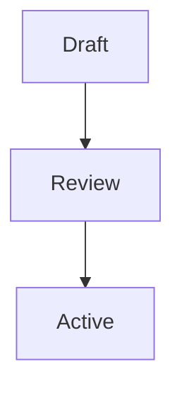

# 01 - Markdown Style Guide

## Purpose

Define a durable Markdown style for Alpha Proxima documents so notes remain readable in Obsidian, diffable in GitHub, and understandable to future contributors.

---

## Scope

Applies to all Markdown files in the vault, including governance notes, research notes, standards, templates, implementation notes, protocols, and project documentation.

---

## Rules

- Use one H1 per document, matching the frontmatter `title`.
- Use H2 headings for required sections and H3 headings for local subsections.
- Do not skip heading levels.
- Use unordered lists for peer items and numbered lists for ordered workflows.
- Keep tables compact; use tables for comparison, not prose.
- Use fenced code blocks with language labels.
- Use Obsidian wikilinks for internal notes.
- Use standard Markdown links for external URLs.
- Use footnotes only when the note benefits from preserving a readable main flow.
- Store images and attachments in a nearby `Assets/` folder when the document family needs visual material.
- Use Mermaid only for diagrams that clarify relationships, sequence, state, or flow.
- Keep formatting quiet; clarity matters more than decoration.

---

## Examples

### Headings

```markdown
# 01 - Markdown Style Guide

## Purpose

## Scope

### Local Detail
```

### Lists

```markdown
- First peer item
- Second peer item

1. First step
2. Second step
3. Third step
```

### Tables

```markdown
| Field | Rule |
|-------|------|
| status | Use controlled values |
| version | Use semantic versioning |
```

### Callouts

Use Obsidian callouts sparingly.

```markdown
> [!warning]
> This automation must not approve governance decisions.
```

### Code Blocks

```python
def normalize_title(title: str) -> str:
    return " ".join(title.split())
```

### Quotes

Use quotes only for sourced language or preserved institutional wording.

```markdown
> Automation should remove repetition. Never automate institutional judgment.
```

### Links and Wikilinks

```markdown
Internal: [[Vault Structure Convention]]
External: [Python packaging guide](https://packaging.python.org/)
Display text: [[ADR Template|Architecture Decision Record]]
```

### Backlinks

Create backlinks intentionally by linking from the dependent note to the governing standard.

### Footnotes

```markdown
This rule preserves Git readability.[^1]

[^1]: Git diffs remain clearer when markup is minimal.
```

### Images

```markdown

```

### Mermaid



---

## Best Practices

- Write documents for scanning first, deep reading second.
- Keep paragraphs short.
- Prefer a simple section over a deeply nested outline.
- Put examples immediately after the rule they illustrate when useful.
- Use filenames and H1s that can stand alone in search results.
- Keep repeated document sections in the same order across standards.

---

## Common Mistakes

- Multiple H1 headings in one note.
- Headings used for visual size instead of structure.
- Bare URLs where a named Markdown link would be clearer.
- Long tables that should be prose or separate reference documents.
- Mermaid diagrams used where a short list would be clearer.
- Images without local organization or descriptive alt text.

---

## Future Evolution

Future versions may add a house style for diagrams, screenshots, generated assets, and large technical references. Any change should preserve compatibility with Obsidian and plain Git diffs.

---

## Version History

| Version | Date | Author | Summary |
|---------|------|--------|---------|
| 1.0.0 | 2026-07-02 | [[CODEX]] | Initial Markdown style standard |

---

## Related Standards

- [[02 - YAML Frontmatter Standard]]
- [[03 - Folder Naming Convention]]
- [[04 - File Naming Convention]]
- [[10 - Template Standard]]

