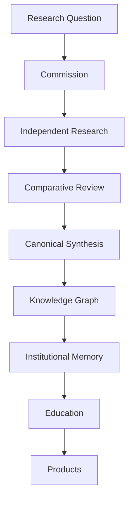

# Research Lifecycle Diagram

## Purpose

Describe the operational lifecycle that turns research questions into durable institutional memory and downstream applications.

## Lifecycle

## Implementation Notes

Engineering maintains the lifecycle infrastructure. Research Intelligence and governance determine research quality, review, and institutional adoption.

## Future Improvements

- [ ] Add JSON data export for dashboards.
- [ ] Add research program creation automation.
- [ ] Add research debt trend history.

## Version History

| Version | Date | Author | Summary |
|---------|------|--------|---------|
| 1.0.0 | 2026-07-02 | [[CODEX]] | Research lifecycle diagram created. |
