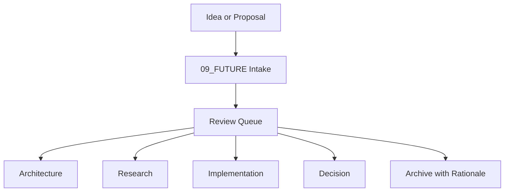

# 09_FUTURE

## Purpose

`09_FUTURE` is the permanent institutional office for preserving future evolution of the Alpha Proxima Foundation without allowing undeveloped ideas to become architectural debt.

Its purpose is not to collect ideas. Its purpose is to preserve institutional evolution.

Ideas should never be forgotten. Ideas should mature until they are ready.

---

## Dependencies

- [[Book I - The Constitution]]
- [[Future Expansion Protocol]]
- [[ALPHA PROXIMA ENGINEERING HANDBOOK]]
- [[Vault Structure Convention]]

---

## Version

| Field | Value |
|-------|-------|
| **Version** | 1.0.0 |
| **Status** | active |
| **Last Updated** | 2026-07-02 |

---

## Author

[[CODEX]]

---

## Related Documents

- [[Future Expansion Protocol]]
- [[ALPHA PROXIMA ENGINEERING HANDBOOK]]
- [[Vault Structure Convention]]
- [[ADR Template]]
- [[Concept Note Template]]

---

## Related Research Programs

- N/A

---

## Implementation Notes

This office preserves proposals before they are ready to become architecture, research, implementation, or governance decisions. Placement in `09_FUTURE` does not imply approval.

No proposal should disappear. Every proposal should either:

- Become Architecture
- Become Research
- Become Implementation
- Become a Decision
- Be Archived with rationale

---

## Future Improvements

- [ ] Add automated proposal ID generation.
- [ ] Add Review Queue dashboards.
- [ ] Add migration tooling for proposals that mature into ADRs, research commissions, or implementation notes.
- [ ] Add periodic review reports.

---

## Context

The Foundation will evolve across decades. Some ideas will be premature but valuable. Some will need research. Some will require technical validation. Some will become institutional decisions later.

`09_FUTURE` protects those possibilities by giving them a formal home, a review process, and a path toward maturity.

---

## Core Content

### Office Structure

| Area | Purpose |
|------|---------|
| [[Roadmap Index]] | Future sequencing and long-range milestones |
| [[Architectural Proposals Index]] | Potential institutional architecture changes |
| [[Research Commissions Index]] | Future research mandates and investigations |
| [[Future Institutes Index]] | Proposed institutes or institutional bodies |
| [[Future Cognitive Functions Index]] | Proposed cognitive functions or reasoning roles |
| [[Technology Watch Index]] | Technologies to monitor without premature adoption |
| [[Implementation Proposals Index]] | Future technical build proposals |
| [[Feature Requests Index]] | Requested improvements to tools, vault, workflows, or systems |
| [[Founder Ideas Index]] | Founder-originated future ideas |
| [[AI Recommendations Index]] | AI-originated recommendations requiring human review |
| [[Review Queue Index]] | Items awaiting review, routing, or maturation |
| [[Decision Log Index]] | Record of how future proposals are routed or resolved |
| [[Future Templates Index]] | Reusable templates for this office |
| [[Future Archive Index]] | Preserved closed, rejected, or superseded proposals |

### Maturation Path

### Operating Rule

Future proposals remain non-binding until they pass through the appropriate Foundation governance, research, or implementation process.

---

## Open Questions

- [ ] Should `09_FUTURE` eventually replace or renumber `09_PEOPLE`, or should the vault maintain both top-level folders?
- [ ] Should future proposal IDs be sequential globally or scoped by proposal type?

---

## Version History

| Version | Date | Author | Summary |
|---------|------|--------|---------|
| 1.0.0 | 2026-07-02 | [[CODEX]] | Created permanent Future Office |

